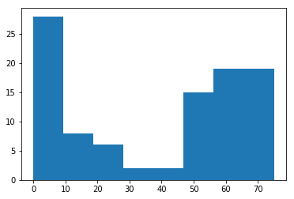

# Standard Deviation Lab

## Problem Description

In this lab, we'll learn to calculate standard deviation and variance, and gain intuition for what it means and how it can be useful.


## Objective
* Calculate Standard Deviation of a sample or population
* Calculate the Variance of a sample or population
* Explore the relationship between Standard Deviation and Variance


### Measures of Dispersion

In previous labs, we learned about _Measures of Center_ such as **_mean_** and **_median_**.  These metrics help give us a general understanding of where the values lie in the range of our data. However, they don't tell us the whole picture, and can often be misleading.  To truly understand our data, we also need _Measures of Dispersion_--namely, **_Standard Deviation_** and **_Variance_**.  These measures tell us how tightly or loosely clustered around the center our data is, and generally act as a measure of how "noisy" our dataset is or isn't.

In this lab, we'll manually calculate standard deviation and variance and explore the relationship between them, as well as their relationship with other summary statistics such as the mean. 

### Calculating Variance

In the cell below, write a function that takes an array of numbers as input and returns the Variance of the sample as output. 

Recall that the formula for calculating variance is:

<center></center>

Where:

$\sigma^2 = Variance$

$N = Size\ of\ Sample$

$\bar{x} = Sample\ Mean$


```python
import numpy as np

def variance(sample):
    # First, calculate the sample mean
    N = len(sample) - 1
    total = sum(sample)
    sample_mean = total/N
    
    # Now, subtract the sample mean from each point and square the result. 
    val_minus_mu_accumulator = 0
    for i in sample:
        val_minus_mu_total += (i - sample_mean)**2
    
    # Divde the total by the number of items in the sample  
    variance =val_minus_mu_accumulator / N
    
    return variance
```

### Calculating Standard Deviation

In the cell below, write a function that takes an array of numbers as input and returns the standard deviation of that sample as output.  

Recall that the formula for Standard Deviation is:

<center></center>

Where:

$\sigma = Standard\ Deviation$

$\mu = Sample\ Mean$

$N = Size\ of\ Sample$

**_Hint_**: How are the these formulas related? Can knowing one help you calculate the other?

For a refresher on how to calculate the standard deviation, take a look at this [tutorial](https://www.mathsisfun.com/data/standard-deviation-formulas.html). For the function below, only use `numpy` to calculate square roots as needed. Avoid using the library's `std` function to calculate standard deviation at this step--calculate everything as needed using only basic python.  


```python
def std_dev(sample):
    return np.sqrt(variance)
```

### Case Study: Life Expectancy

People often use the Mean as a summary statistic to encapsulate all relevant information about a topic.  However, the mean is just a statistic--it deserves no special relevance, and can be misleading in many cases.  An example where this can be misleading is life expectancy in the past.  

Up until the 18th century, the mean life expectancy in most countries was between 30 and 40.  However, the number of people that actually died between the ages of 30 and 40 was actually quite low.  This average person that survived past childhood could expect to live well into the 50s, 60s, or even 70s.  Why, then, is the average life expectancy around 35?

In the cells below, read in the data stored in `ages.csv`.  Calculate the mean and standard deviation.  Then, use `matplotlib` to create a histogram of the data with 8 bins.  

When examining the data, consider the following questions:

1.  Why did so few people actually die at the mean life expectancy age? Is the mean life expectancy a good metric or not? Why?
1.  What does a high standard deviation tell us about the mean?  

(Author's Note: Although the ranges in this case study are generally true to historical record, the data in `ages.csv` was made up for this problem.)


```python
import pandas as pd

# read the stored data 'ages.csv'
ages = pd.read_csv('ages.csv', squeeze=True)

# calculate the mean and the variance and print
mean = np.mean(ages)
std = np.std(ages)
print("Mean Life Expectancy: {}".format(mean))
print("Standard Deviation: {}".format(std))
```

    Mean Life Expectancy: 38.292929292929294
    Standard Deviation: 27.034677515904274


```python
import matplotlib.pyplot as plt
%matplotlib inline
plt.hist(ages, bins=8);
```





### Conclusion

In this lab, we learned:
* How to calculate the variance of a sample
* How to calculate the standard deviation of a sample
* The relationship between standard deviation and variance
* How we can use measures of dispersion to inform our  understanding of measures of center
